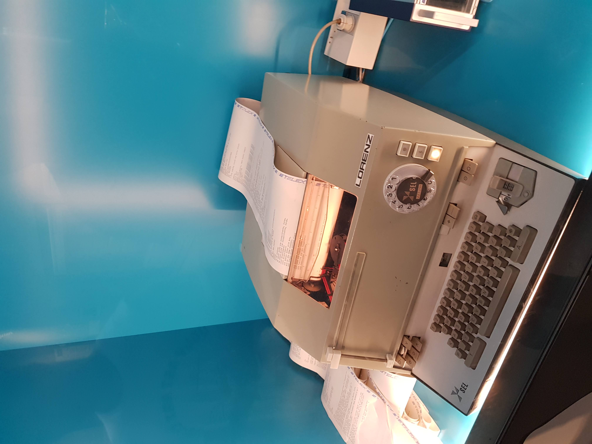



*Post został przetłumaczony maszynowo z oryginału w języku angielskim. Przepraszam za błędy! :)*

## Wprowadzenie

Zainspirowałem się wizytą w Deutsches Technikmuseum. Dwa eksponaty wzbudziły moje zainteresowanie:

- Praca #aufschrei ([#outcry](https://en.wikipedia.org/wiki/Aufschrei)) z 2013 roku kreatywnie wykorzystała drukarkę termiczną do pokazania ogromu tweetów dotyczących tematu.
- Teleprinter Lorenza podłączony do strony internetowej umożliwiał każdemu wydrukowanie wiadomości na papierowym podajniku.


{{}}
{{}}


To skłoniło mnie do zastanowienia się: ile kosztuje drukarka termiczna? Wygląda na to, że nie wiele. Postanowiłem zakupić drukarkę Bon Star TSP 700II za nieco mniej niż 150 PLN (30 USD). Drukowanie scrobbles było jednym z moich pomysłów i okazało się najszybsze do zrealizowania, więc postanowiłem się trochę pobawić.

### Ale dlaczego?

Dobre pytanie.

## Konfigurowanie drukarki

Na początek musiałem zakupić papier termiczny. TSP700 II obsługuje rolki o szerokości do 80 mm, więc wybrałem największy dostępny rozmiar.

Sterowniki noszą nazwę "StarPRNT Intelligence" i są dostępne na [stronie producenta](https://starmicronics.com/support/download/starprnt-intelligence-software-full-v3-7-2/). Po podłączeniu drukarki do komputera za pomocą kabla USB A-B mogłem rozpocząć proces konfiguracji.

Pierwszym krokiem było określenie obecnego trybu emulacji. Wykonałem wcześniejsze badania i wiedziałem, że chcę używać trybu ESC/POS ze względu na istniejące biblioteki. Szybkie wyszukiwanie w Google pokazało, że muszę uruchomić samotest. Wyłączyłem drukarkę, przytrzymałem przycisk FEED, a następnie ją ponownie włączyłem. Tryb emulacji był ustawiony na StarLine.

{{}}

Zmiana trybu emulacji wymagała przestawienia kilku przełączników sprzętowych. Jak napisano na [stronie Starmicronics](https://starmicronics.com/help-center/knowledge-base/how-to-switch-emulations-on-star-desktop-printers/), wyłączyłem drukarkę, zdjąłem pokrywę drukarki i przestawiłem pozycję DISPW 1-1 na OFF. Kolejny samotest potwierdził, że tryb emulacji to teraz ESC/POS.

Po ustawieniu trybu emulacji mogłem teraz korzystać z oprogramowania producenta do zabawy z drukarką. Drukowanie tekstu, kodów QR i obrazów działało dobrze. Jednak okazało się, że drukarka TSP700 II nie obsługuje polskich znaków i ogólnie UTF-8. No cóż, to tylko drobna przeszkoda.

## Instalowanie bibliotek Pythona
Zdecydowałem się użyć Pythona 3, aby szybko uruchomić projekt. Wybrałem najpopularniejszą bibliotekę, [python-escpos](https://python-escpos.readthedocs.io/en/latest/user/usage.html).

Początkowo chciałem stworzyć projekt w środowisku WSL2. To jest niemożliwe, ponieważ [nie obsługuje dostępu do urządzeń USB](https://github.com/microsoft/WSL/issues/5158). Najwyraźniej [niedawna aktualizacja](https://devblogs.microsoft.com/commandline/connecting-usb-devices-to-wsl/) umożliwiła to na Windows 11, ale ja korzystam z Windows 10.

Instalacja python-escpos nie wystarczyła. Aby naprawić błąd NoBackendError: "No backend available", trzeba zainstalować Libusb i skopiować jego pliki DLL do odpowiednich ścieżek. Postępowałem zgodnie z [tym przewodnikiem](https://github.com/pyusb/pyusb/issues/120#issuecomment-322058585), który znalazłem w wątku na Githubie.

Aby wywołać drukarkę za pomocą kodu, musiałem określić typ połączenia. Niestety, przypadkowo obrałem niewłaściwą ścieżkę i próbowałem połączyć drukarkę jako urządzenie USB, zamiast jako urządzenie szeregowe. Niemniej jednak opiszę niezbędne kroki.

### Podłączanie do drukarki ESC/POS przez USB
Aby podłączyć drukarkę USB, musisz określić identyfikator producenta (Vendor ID) i identyfikator produktu (Product ID). Pod Linuksem jest to proste za pomocą polecenia 'libusb'. Pod Windowsem musisz uruchomić Powershell. Użyłem następującego polecenia:

```
Get-PnpDevice -PresentOnly | Where-Object { $_.InstanceId -match '^USB' } | Format-List
```

Snippet outputu:

```
HardwareID                  : {USB\VID_0519&PID_0002&REV_0400, USB\VID_0519&PID_0002}
Manufacturer                : Star Micronics
PNPClass                    : Ports
Present                     : True
Service                     : SMJUSB
PSComputerName              :
Class                       : Ports
FriendlyName                : SMJ USB Device (COM5)
```

ID producenta i ID produktu są odpowiednio zapisane po prefiksach VID_ i PID_. Inną opcją jest użycie Pythona wraz z wcześniej zainstalowanym libusb:

```python
import usb.core
import usb.util
list(usb.core.find(find_all=True))[0]
# <DEVICE ID 0519:0002 on Bus 000 Address 001>
list(usb.core.find(find_all=True))[0].idVendor
# 1305
list(usb.core.find(find_all=True))[0].idProduct
# 2
```

Wartości "idVendor" w Pythonie i "V_ID" w Powershell są zgodne - pierwsza jest liczbą całkowitą, a druga jest szesnastkowa. Powinny wystarczyć do połączenia z drukarką. Spróbujmy tego.

```python
from escpos.printer import Usb
p = Usb(1305, 2) 
```

Napadł mnie kolejny błąd. Jak się okazuje, biblioteka [nie wspiera w pełni systemu Windows](https://nyorikakar.medium.com/printing-with-python-and-epson-pos-printer-fbd17e127b6c). Istnieją dwie opcje, które pozwalają naprawić błąd NotImplementedError: detach_kernel_driver i obie wymagają modyfikacji kodu biblioteki. Najlepszym rozwiązaniem byłoby [utworzenie własnej wersji pakietu](https://stackoverflow.com/questions/23075397/python-how-to-edit-an-installed-package).

Brutalnym podejściem byłoby zmodyfikowanie kodu pakietu, który znajduje się w katalogu site_packages. To mi się podoba. Najpierw znajdź lokalizację kodu źródłowego, wykonując:

```python
import escpos
escpos.__file__
# 'O:\\Users\\Maciej\\AppData\\Local\\Programs\\Python\\Python37-32\\lib\\site-packages\\escpos\\__init__.py'
```

Zakomentuj poniższy snippet w pliku printer.py:

```python
try:
	check_driver = self.device.is_kernel_driver_active(0)
except NotImplementedError:
	pass

if check_driver is None or check_driver:
	try:
		self.device.detach_kernel_driver(0)
	except NotImplementedError:
		pass
	except usb.core.USBError as e:
		if check_driver is not None:
			print("Could not detatch kernel driver: {0}".format(str(e)))
```

Teraz wszystko powinno działać. Upewnij się, że twoja drukarka faktycznie nie korzysta z połączenia szeregowego. Napotkałem kilka nondeterministycznych wyjątków, zrobiłem krok w tył i zmieniłem tryb połączenia.

### Połączenie z drukarką szeregową
Połączenie z drukarką szeregową jest prostsze. Z poprzedniego wyniku polecenia Powershell możemy zauważyć, że moja drukarka jest podłączona do portu 'COM5'. 

```python
from escpos.printer import Serial
p = Serial('COM5')
# Włączono drukarkę szeregową
p.text('test')
p.cut()
```

Działa! Pełne API drukarki opisane jest w [dokumentacji biblioteki](https://python-escpos.readthedocs.io/en/latest/). Teraz możemy przejść do wywołania last.fm.

## Wywołanie API last.fm
Aby korzystać z API last.fm, potrzebujesz klucz API. Można go otrzymać natychmiast po [stworzeniu konta API](https://www.last.fm/api/account/create).

Endpointy są dobrze udokumentowane. W naszym przypadku musimy tylko wywołać [user.getRecentTracks](https://www.last.fm/api/show/user.getRecentTracks). "Ta usługa nie wymaga uwierzytelniania" oznacza, że mogłem po prostu użyć biblioteki requests bez żadnej dodatkowej logiki. 

Ostatnim krokiem było sprawdzenie [regulaminu usługi](https://www.last.fm/api/tos) i zapoznanie się z limitem. W punkcie 4.3.4 możemy przeczytać, że "Rozsądny limit użytkowania" jest dość hojny z limitem 100 MB, jednak nie mogłem znaleźć oficjalnych informacji na temat akceptowalnej częstotliwości odpytywania. Według komentarzy na Quora i reddicie, limit wydaje się wynosić od 1 do 5 żądań na sekundę. To świetne, ponieważ nie zbliżymy się do tej liczby.

### Pobieranie najnowszych scrobbles z API
Muszę ciągle pytać API, aby otrzymać najnowsze scrobbles. Nie chciałem przekroczyć limitu zapytań, więc postanowiłem pobierać scrobbles dla każdego użytkownika co 3 sekundy. To oznacza, że mając 5 użytkowników, otrzymamy dane dla każdego z nich co 15 sekund.

Zdecydowałem się pominąć wydruki utworów "Aktualnie odtwarzane" a zamiast tego raz wydrukować najświeższe scrobble dla każdego użytkownika. Ta decyzja wiąże się z kosztem opóźnienia - drukarka nigdy nie pokaże aktualnie odtwarzanego utworu. Jednak wydruk utworów "Obecnie odtwarzane" jest bardziej skomplikowany:
- data scrobble'a nigdy nie byłaby dokładna, a musiałbym korzystać tylko z lokalnego czasu;
- nie wiedziałbym, czy piosenka została pominięta czy faktycznie odtworzona;
- nadmierne pomijanie utworów prowadziłoby do nadmiernego drukowania (czy to jest funkcja?)


## Końcowy wynik
Działa! Drukarka teraz wydrukuje last.fm scrobbles w czasie rzeczywistym dla określonych nazw użytkowników. Oto [krótki timelapse](https://www.youtube.com/watch?v=LXitXxrE7BM) (wyświetlony na górze posta).



### Kod źródłowy
Kod źródłowy można znaleźć na [moim Githubie](https://github.com/asdfMaciej/scrobbles-printer). Jest on na licencji Apache License 2.0.